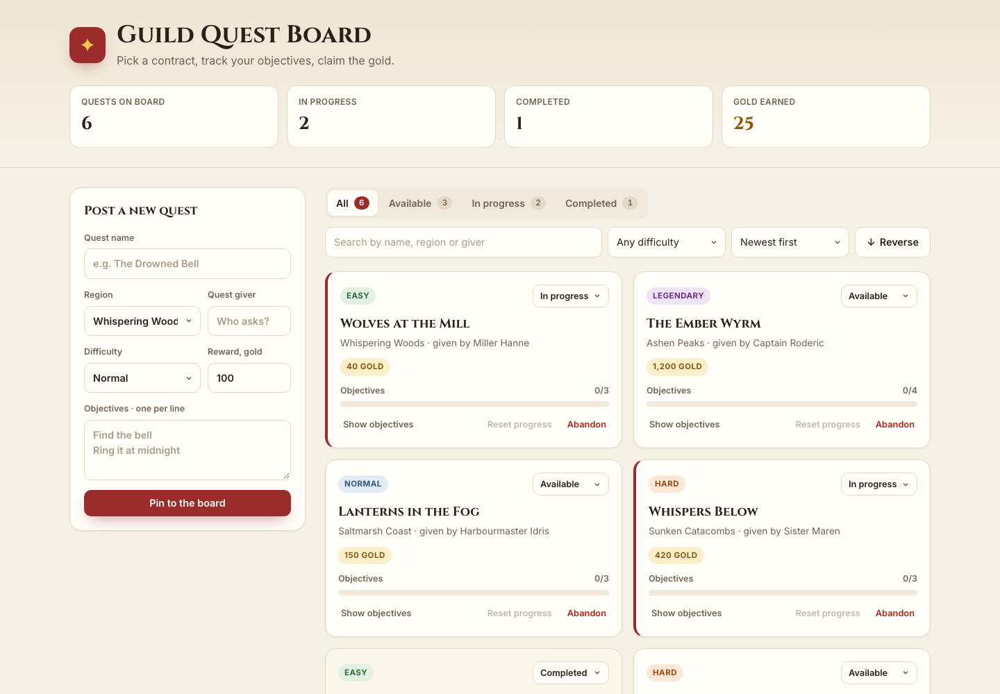

# Task 3 — Guild Quest Board

A single-page RPG quest dashboard built with **React 19 + TypeScript + Vite**.
Post quests, track objectives, change statuses, and claim gold.

**Live:** https://shoqqan.github.io/kbtu-react-course/week-4/



## Features → requirements

| Requirement | Where |
| --- | --- |
| Add / remove items | `AddQuestForm` → `addQuest`; **Abandon** on a card → `removeQuest` |
| Edit an item's status | Status `<select>` on each card, **Claim reward** button → `changeStatus` (parent state) |
| Change an item's local state | Tick objectives, write notes, show/hide details inside `QuestCard` (`useState`) |
| Filter items | Status tabs, difficulty select, search (`Toolbar`) |
| Reorder / reverse | Sort select (newest / reward / difficulty) and **Reverse** button |
| Reset an item's local state | **Reset progress** → bumps `resetCount`, which is part of the card's key |
| Preserve local state when filtering/reordering | Cards are keyed by the stable `quest.id` |
| `console.log` re-renders | Every component logs `[render] …`; cards also log `[mount] …` |

No `useEffect`, Context, Redux or other state libraries. All derived data
(counts, gold earned, the visible list) is computed during render.
The React Compiler is intentionally **not** enabled, so the logs show React's default re-render behaviour.

## Components and state

```
App                     parent state: quests, status, difficulty, search, sortBy, reversed
├─ BoardStats           props only
├─ AddQuestForm         own state: form fields + validation error
├─ Toolbar              controlled by App through props
└─ QuestList            .map() with key = `${quest.id}:${quest.resetCount}`
   └─ QuestCard ×N      own state: doneSteps, notes, expanded
```

```
src/
  app/ui/                   App, entry point, global styles
  entities/quest/           Quest types, constants, seed data, QuestCard
  features/add-quest/       AddQuestForm
  widgets/                  BoardStats, Toolbar, QuestList
  shared/ui/                Button, Badge
```

## Defense notes

**What triggers a re-render.** Calling a state setter re-renders the component that owns
that state *and all of its children*. Type in the search box: `App` state changes, so the
console shows `[render] App`, `BoardStats`, `AddQuestForm`, `Toolbar`, `QuestList` and every
visible `QuestCard`. Tick an objective: only that card's state changes, so only
`[render] QuestCard "…"` for that one card appears. Typing in the add form re-renders only
`AddQuestForm`, because the form state lives in the child, not in `App`.
(In dev, `StrictMode` renders twice — the second log is shown dimmed.)

**Reconciliation & component identity.** After a render React compares the new element
tree with the previous one. If at the same position it finds the same component type with
the same key, it treats it as the *same* component: it updates the props and **keeps the
state**. A different type or a different key means a *new* component: the old one is
unmounted (state lost) and a new one is mounted.

**Why `key={quest.id}` and not the index.** Tick objectives on "Wolves at the Mill", then press
**Reverse** or filter by "In progress" — the progress follows the quest because its key
travels with it. With `key={index}` React would match cards by position, so after reversing
the first card's ticked objectives would appear on whichever quest is now first.

**Intentional reset with keys.** **Reset progress** doesn't touch the card's state directly.
`App` increments `quest.resetCount`, so the key changes from `q-wolves:0` to `q-wolves:1`.
React sees a new component, unmounts the old card and mounts a fresh one — the console
shows `[mount] QuestCard "Wolves at the Mill"` and the checklist/notes are empty. Other cards
keep their state because their keys didn't change.

## Scripts

```bash
pnpm install
pnpm dev       # http://localhost:5173/kbtu-react-course/week-4/
pnpm build     # type-check + production build into dist/
pnpm lint      # oxlint
pnpm deploy    # build + publish dist/ to gh-pages under /week-4
```

`pnpm deploy` pushes into the `week-4/` folder of the `gh-pages` branch (`-e week-4 --add`),
so the week-3 site at the root of the branch stays untouched.
